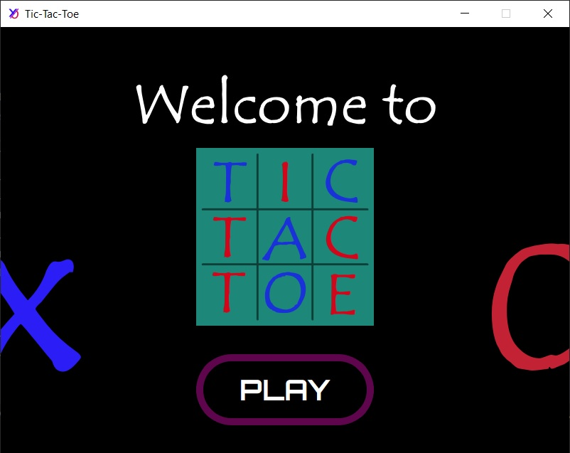
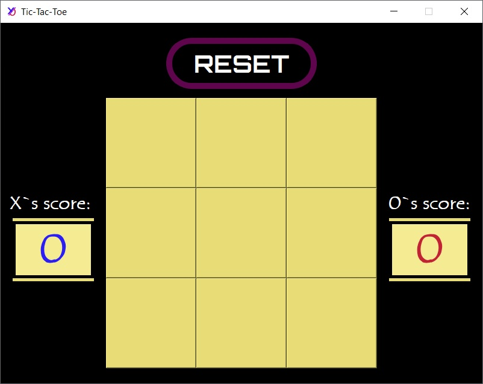
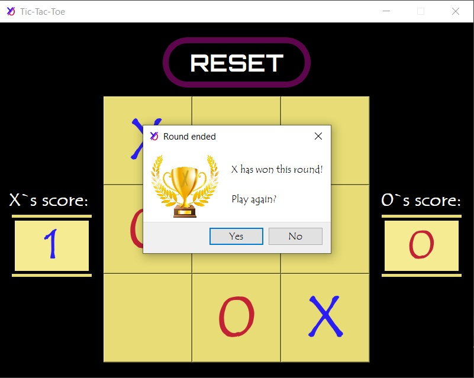
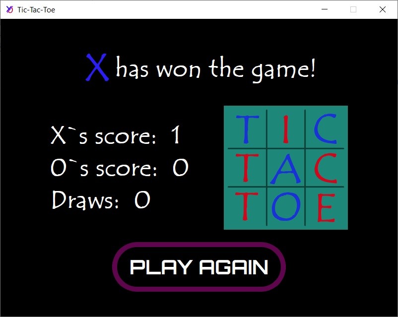

<h1>Tic-Tac-Toe</h1>
<h2>Two-player Tic-Tac-Toe game</h2>
 

    

        
Frame 1

        
    

    

        
Frame 2

        
    

 

    

        
PopUp

        
    

    

        
Frame 3

        
    

